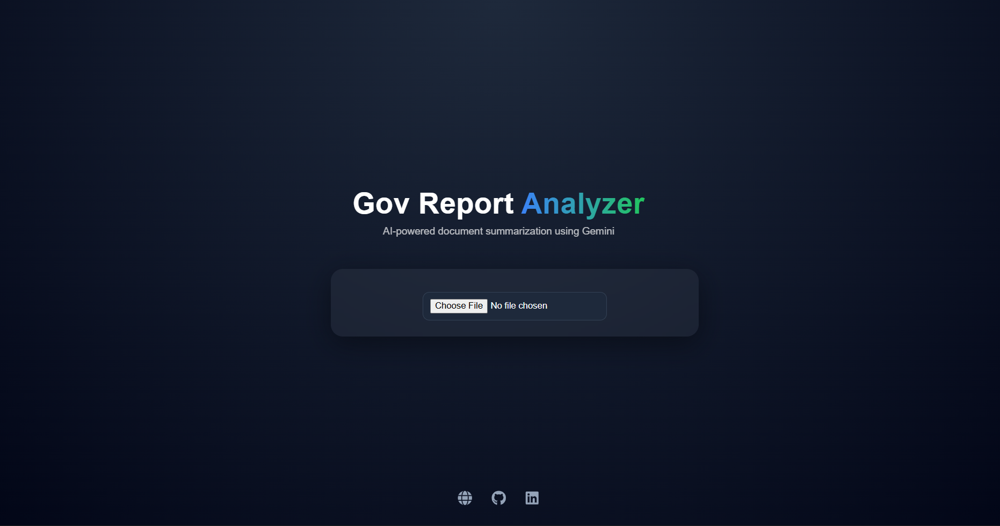

# Government Report Analyzer  

🚀 An AI-powered web app that analyzes and summarizes government reports (PDF/Image) using **Google Gemini API**.  

🌐 **Live Demo:** https://gov-report-analyzer.netlify.app/  

---

## ✨ Features  

- 📂 Upload **PDF or Image files**  
- 🧠 Extracts text from documents  
- 🤖 Generates **2-line concise AI summary (Gemini)**  
- ⚡ Handles edge cases (invalid files, empty text, API failures)  
- 🌐 Fully deployed (Frontend + Backend)  
- 🎨 Modern, aesthetic UI with smooth animations  

---

## 🛠️ Tech Stack  

| Category   | Technologies |
|------------|-------------|
| 💻 Frontend | React (Vite), Axios, CSS (Glassmorphism UI) |
| ⚙️ Backend  | Node.js, Express.js, File Handling |
| 📄 Parsing  | PDF-Parse |
| 🤖 AI       | Google Gemini API |
| ☁️ Deployment | Netlify (Frontend), Render (Backend) |

---

## 📸 Preview  



---

## ⚙️ How It Works  

1. 📤 Upload a PDF/Image  
2. 🧾 Backend extracts text  
3. 🤖 Gemini processes content  
4. ✨ Returns a clean 2-line summary  

---

## ⚠️ Note  

- Gemini API may have **free-tier quota limits**  
- Fallback mechanism ensures the app always responds  

---

## 🚀 Getting Started (Local Setup)  

### 1️⃣ Clone the repo  

```bash
git clone https://github.com/SamP231004/Gov-Report-Analyzer.git
cd Gov-Report-Analyzer
````

---

### 2️⃣ Setup Backend

```bash
cd functions
npm install
```

Create `.env` file:

```env
GEMINI_API_KEY=your_api_key_here
```

Run backend:

```bash
npm start
```

---

### 3️⃣ Setup Frontend

```bash
cd frontend
npm install
```

Create `.env`:

```env
VITE_API_URL=http://localhost:5000/analyze
```

Run frontend:

```bash
npm run dev
```

---

## 🌐 Deployment

* 🚀 Frontend → Netlify
* ⚙️ Backend → Render

---

## 👨‍💻 About Me

* 📄 Resume: [https://drive.google.com/file/d/1Ci5U-3jc_Xhmj7oOVeFsdix1uGfOCAom/view](https://drive.google.com/file/d/1Ci5U-3jc_Xhmj7oOVeFsdix1uGfOCAom/view)
* 🌐 Portfolio: [https://samp231004.github.io/Portfolio/](https://samp231004.github.io/Portfolio/)
* 💻 GitHub: [https://github.com/SamP231004](https://github.com/SamP231004)
* 🔗 LinkedIn: [https://www.linkedin.com/in/samp231004/](https://www.linkedin.com/in/samp231004/)

---

## 💡 Future Improvements

* 🎯 Drag & Drop upload
* 📚 Multi-page document support
* 📊 Highlight key insights
* 🧠 Save report history

---